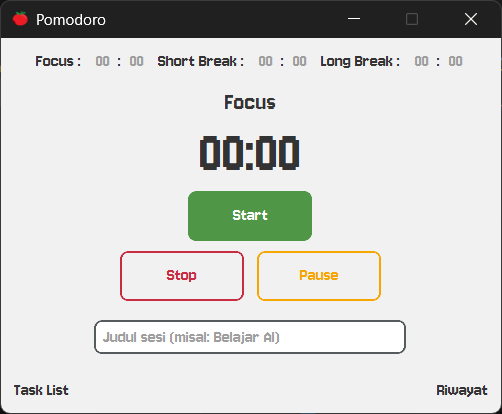
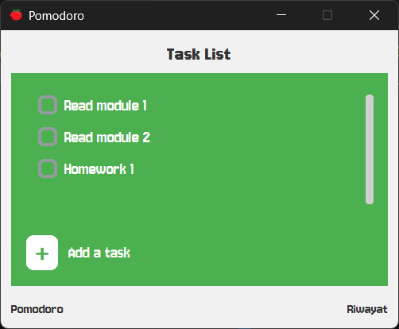
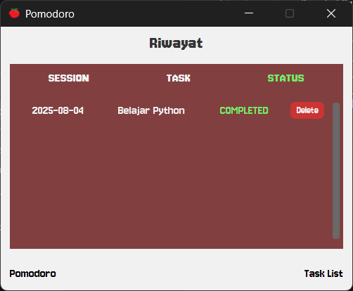

# 🍅 Pomodoro Timer

Aplikasi Pomodoro Timer yang dibuat dengan Python dan CustomTkinter untuk membantu meningkatkan produktivitas dengan teknik Pomodoro. Aplikasi ini dilengkapi dengan fitur manajemen tugas dan riwayat sesi.

## ✨ Fitur

- ⏰ **Timer Pomodoro**: Timer fokus, istirahat pendek, dan istirahat panjang yang dapat dikustomisasi
- 📝 **Task List**: Manajemen daftar tugas yang perlu diselesaikan
- 📊 **Riwayat Sesi**: Pelacakan sesi pomodoro yang telah diselesaikan
- 🎨 **UI Modern**: Interface yang clean dan user-friendly menggunakan CustomTkinter
- 💾 **Penyimpanan Data**: Data disimpan dalam format JSON untuk persistensi

## 📸 Preview Aplikasi

### Halaman Utama (Timer)



### Halaman Task List



### Halaman Riwayat



## 🚀 Setup Instructions

### 1. Clone Repository

```bash
git clone https://github.com/MuhammadFarrasThohari/Pomodoro.git
cd Pomodoro
```

### 2. Buat Virtual Environment

```bash
python -m venv venv
```

### 3. Aktivasi Virtual Environment

**Windows:**

```bash
venv\Scripts\activate
```

**macOS/Linux:**

```bash
source venv/bin/activate
```

### 4. Install Dependencies

```bash
pip install -r requirement.txt
```

### 5. Jalankan Aplikasi

```bash
python Main.py
```

## 📋 Dependencies

- `customtkinter==5.2.2` - Modern UI framework untuk Python
- `darkdetect==0.8.0` - Deteksi tema sistem (dark/light mode)
- `packaging==25.0` - Utilities untuk packaging

## 🎯 Cara Penggunaan

1. **Atur Waktu**: Masukkan durasi untuk sesi fokus, istirahat pendek, dan istirahat panjang
2. **Masukkan Judul**: Berikan judul untuk sesi pomodoro Anda
3. **Mulai Timer**: Klik tombol "Start" untuk memulai sesi
4. **Kelola Tugas**: Gunakan menu "Task List" untuk menambah dan mengelola tugas
5. **Lihat Riwayat**: Akses menu "Riwayat" untuk melihat sesi yang telah diselesaikan

## 📁 Struktur File

```bash
Pomodoro/
├── Main.py              # File utama aplikasi
├── HomePage.py          # Halaman timer utama
├── TaskListPage.py      # Halaman manajemen tugas
├── RiwayatPage.py       # Halaman riwayat sesi
├── pomodoro_sessions.json # Data riwayat sesi (dibuat otomatis)
├── task_data.json       # Data tugas (dibuat otomatis)
├── requirement.txt      # Dependencies
├── font/                # Font custom
│   └── Jersey10-Regular.ttf
├── preview/             # Screenshot aplikasi
│   ├── Home.png
│   ├── Tasklist.png
│   └── Riwayat.png
└── Archive/             # File backup/lama
```

## 🔧 Teknologi yang Digunakan

- **Python 3.x**
- **CustomTkinter** - Framework UI modern
- **JSON** - Penyimpanan data
- **datetime** - Manajemen waktu dan tanggal

## 📄 License

Project ini dibuat untuk keperluan pembelajaran pemrograman visual.

---
⭐ Jika aplikasi ini membantu, jangan lupa untuk memberikan star di repository ini!
